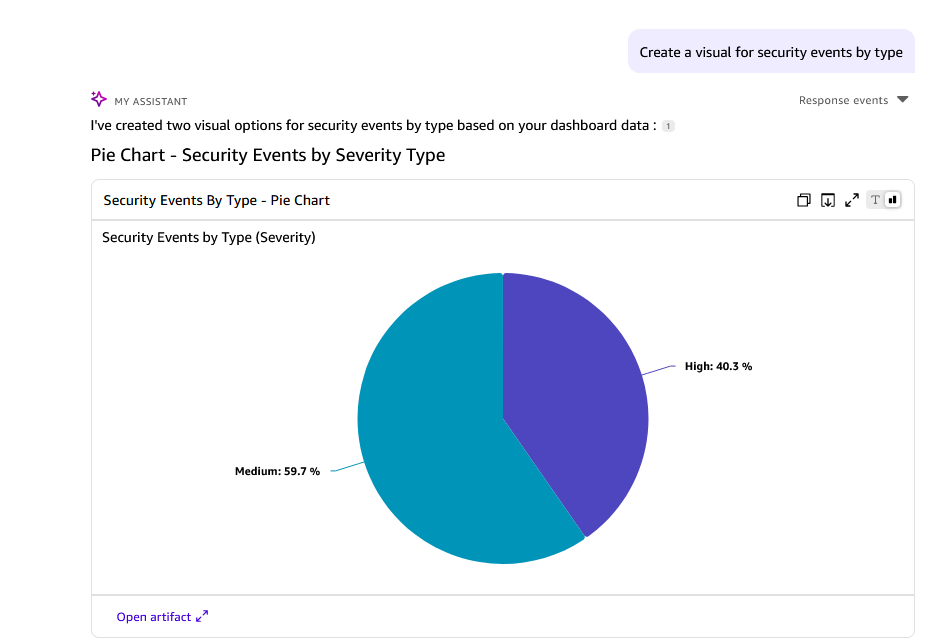
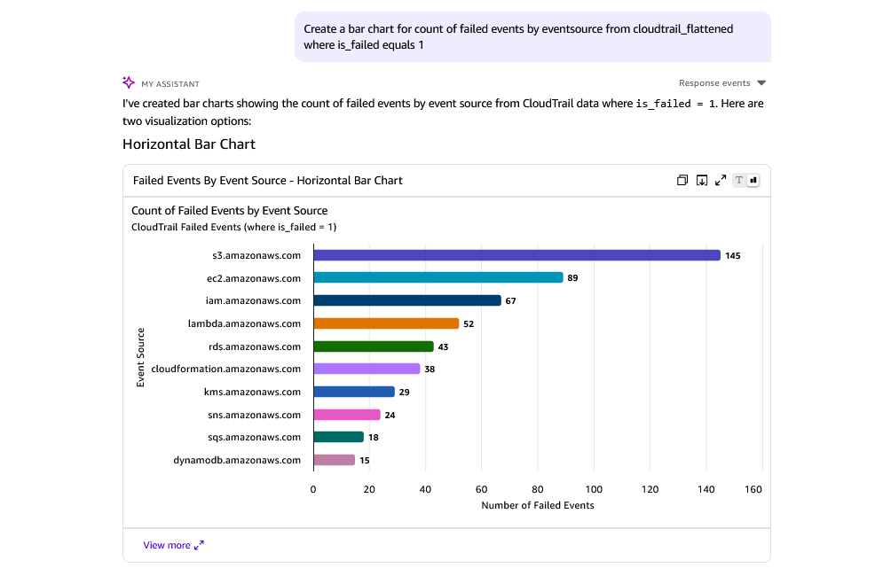

 # Building enterprise CloudTrail security analytics dashboards using Amazon Quicksuite 

by Vy Nguyen and Majid Kamyab on 2025-11-03 in Amazon QuickSuite, AWS CloudTrail, AWS Glue, AWS Step Functions, Security & Compliance, Management & Governance Permalink Share 

 

In today's complex cloud environments, monitoring and visualizing security events across your AWS infrastructure is crucial for maintaining compliance and detecting threats. Traditionally, creating comprehensive CloudTrail analytics dashboards in [Amazon QuickSight](https://aws.amazon.com/quickssight/) has been a manual, time-intensive process requiring multiple steps for data processing, transformation, and visualization. 

 

[Amazon QuickSuite](https://aws.amazon.com/quickssuite/) is a cloud-native business intelligence service that transforms this experience by enabling natural language interactions with your CloudTrail data. This blog explores how Amazon QuickSuite simplifies dashboard creation through AI-powered capabilities, allowing you to reduce complex multi-step processes into intuitive prompts. Learn how you can quickly generate insightful security analytics and compliance visualizations from your CloudTrail logs. Discover how automated data processing pipelines help you create dynamic dashboards, saving valuable time while maintaining accuracy, and providing real-time insights into your organization's security posture. Whether you're a security analyst, compliance officer, or cloud architect, this guide demonstrates how modern analytics revolutionizes the way you monitor and report on AWS security events. 

 

Furthermore, this solution provides comprehensive visibility into your cloud security through custom analytical views. Create visualizations to monitor user activities, track resource changes, identify security anomalies, and maintain compliance across your AWS environment to better understand your security landscape. 

 

## Solution Overview 

 

**Figure 1 – Architecture diagram** 

 

The solution leverages several AWS services to automate CloudTrail log processing and utilize Amazon QuickSuite to visualize security data. AWS CloudTrail continuously logs API calls and writes encrypted logs to Amazon S3. An automated processing pipeline using AWS Step Functions orchestrates AWS Glue jobs that transform raw CloudTrail logs into optimized Apache Iceberg format. Amazon Athena provides analytical views over the processed data, which Amazon QuickSuite connects to for creating interactive security dashboards. 

 

The solution is deployed using AWS Cloud Development Kit (AWS CDK) to create the resources, including Amazon S3 bucket for log storage, AWS KMS key for encryption, AWS Glue database and jobs for data processing, AWS Step Functions for orchestration, Amazon EventBridge for scheduling, and Amazon QuickSuite datasets and analysis dashboards. The solution operates on automated schedules: AWS Step Functions executes CloudTrail log processing every week, and AWS Glue crawler performs data synchronization with Amazon Athena database. Both scheduling intervals can be modified to align with specific organizational requirements. 

 

The solution transforms raw CloudTrail logs into structured, queryable data through an automated processing workflow. When CloudTrail writes JSON log files to S3, the Step Functions orchestrator triggers a series of operations that convert these logs into Apache Iceberg format for optimal analytics performance.

Here's how the processing works:

**Data Discovery and Preparation**: Lambda functions scan the S3 bucket to identify new CloudTrail log files and organize them by date partitions. This ensures the system processes only new data and maintains efficient storage organization.

**Parallel ETL Processing**: AWS Glue jobs extract security-relevant fields from CloudTrail events, flatten nested JSON structures, and enrich the data with calculated fields like operation types and risk indicators. Multiple Glue jobs run simultaneously to process different date ranges, significantly reducing processing time.

**Intelligent Resource Management**: The system automatically scales Glue job capacity based on the volume of logs being processed. Small datasets use fewer resources to minimize costs, while large datasets get additional compute power to maintain performance.

**Data Catalog Integration**: Processed data is registered in the AWS Glue Data  as Iceberg tables, making it immediately available for querying through Amazon Athena. The system maintains proper partitioning and schema evolution to ensure consistent query performance. 

The Apache Iceberg format provides several performance benefits for CloudTrail analytics: 

- **Partition Pruning**: Queries automatically filter by date partitions 

- **Column Pruning**: Only required columns are read from storage 

- **Predicate Pushdown**: Filters are applied at the storage level 

- **Schema Evolution**: Tables can evolve without breaking existing queries 

This information is processed into Apache Iceberg format for optimal query performance. The analytical views in Amazon Athena provide pre-built abstractions for common security use cases, making it easy to create QuickSuite visualizations. 
**Creating a cloudtrail dashboard using Amazon Quicksuite**: 
A dashboard is prepared using the Amazon Q as a helper (TO BE EXPLAINED MORE)
 

## Prerequisites 

 

For this walkthrough, you must have the following: 

 

- AWS CLI configured with appropriate permissions 

- AWS Cloud Development Kit (AWS CDK) version 2.91.0 or later installed 

- Python 3.9 or later for CDK development 

- Node.js 18.x or later for CDK runtime 

- Amazon QuickSuite user account with Admin Pro or Author Pro permissions 

- IAM permissions for CloudTrail, Amazon S3, AWS Glue, Amazon Athena, and Amazon QuickSuite 

- An existing VPC (referenced in the CDK configuration) 

 

## Walkthrough 

This solution offers two deployment options to accommodate different user preferences and technical expertise levels.

### Deployment Option 1: Using AWS CDK (For Technical Users)

**Repository:** [CDK Deployment Repo](https://github.com/Kamyab-Majid/cloudtrail-events-quicksuite)

We will deploy the solution using AWS CDK Stack to create the required resources. The CDK Stack can be deployed from any AWS account with appropriate permissions. The CloudTrail logs, processing pipeline, and QuickSuite dashboards will be created in the stack deployment account and region.

**Steps:**

1. **Download the CDK code from the GitHub repository and deploy the Stack.**

2. **In the CDK configuration, enter the following parameters:**

   - Under the section: **Environment Configuration**
     - **Account ID**: Your AWS account ID for resource deployment
     - **Region**: AWS region for resource deployment (e.g., us-east-1)
     - **Environment**: Environment name (e.g., sandbox, dev, prod)

   - Under the section: **CloudTrail Configuration**
     - **Log Expiration Days**: Number of days to retain CloudTrail logs (default: 14)
     - **Multi-Region Trail**: Enable multi-region CloudTrail logging
     - **Include Global Services**: Include AWS global service events

   - Under the section: **Processing Configuration**
     - **Glue Worker Count**: Number of Glue workers for processing (auto-scaled based on data volume)
     - **Processing Schedule**: EventBridge schedule for automated processing (default: weekly)

   ![CDK deployment parameters for CloudTrail analytics]

   **Figure 2 – AWS CDK parameters – CloudTrail analytics deployment**

3. **Navigate to the AWS CloudFormation console to view the resources created by the CDK Stack.**

### Deployment Option 2: Using CloudFormation Template (For Non-Technical Users)

**Steps:**

1. **Download the [CloudFormation template](https://github.com/Kamyab-Majid/cloudtrail-events-quicksuite/tree/main/cfn_template/CFNCloudTrailAnalytics.yaml) and [Lambda/Glue scripts folder](https://github.com/Kamyab-Majid/cloudtrail-events-quicksuite/tree/main/infra_sandbox/cloudtrail_asset) from the GitHub repository.**

2. **Create an S3 bucket to store Lambda code and Glue scripts:**

   Using AWS Console:
   - Go to S3 → Create bucket
   - Provide a unique bucket name
   - Keep default settings

   Or using AWS CLI:
   ```bash
   aws s3 mb s3://YOUR-BUCKET-NAME
   ```

3. **Upload Lambda code and Glue scripts to your S3 bucket:**

   Using AWS Console:
   - Upload `lambda/file_count_lambda/` folder to `s3://YOUR-BUCKET/lambda/count-files/`
   - Upload `lambda/last_7_days_lambda/` folder to `s3://YOUR-BUCKET/lambda/last-days/`
   - Upload `lambda/max_file_count_lambda/` folder to `s3://YOUR-BUCKET/lambda/max-count/`
   - Upload `glue/cloudtrail_log_processing.py` file to `s3://YOUR-BUCKET/glue/cloudtrail_log_processing.py`

   Or using AWS CLI:
   ```bash
   aws s3 cp lambda/file_count_lambda/ s3://YOUR-BUCKET-NAME/lambda/count-files/ --recursive
   aws s3 cp lambda/last_7_days_lambda/ s3://YOUR-BUCKET-NAME/lambda/last-days/ --recursive
   aws s3 cp lambda/max_file_count_lambda/ s3://YOUR-BUCKET-NAME/lambda/max-count/ --recursive
   aws s3 cp glue/cloudtrail_log_processing.py s3://YOUR-BUCKET-NAME/glue/
   ```

4. **Deploy the CloudFormation stack and enter the following parameters:**

   - Under the section: **Resource Configuration**
     - **AssetsBucket**: Name of the S3 bucket containing Lambda code and Glue scripts (created in step 2)
     - **ResourcePrefix**: Prefix for resource names to allow multiple deployments (e.g., cloudtrail, team1)
     - **Environment**: Environment name (e.g., dev, prod, sandbox)

   - Under the section: **CloudTrail Configuration**
     - **LogExpirationDays**: Number of days to retain CloudTrail logs in S3 (default: 14)

   - Under the section: **Processing Configuration**
     - **NumberOfWorkers**: Number of AWS Glue workers for processing CloudTrail logs (default: 5)

   ![CloudFormation template parameters for CloudTrail analytics]

   **Figure 2 – AWS CloudFormation parameters – CloudFormation deployment**

5. **Check "I acknowledge that AWS CloudFormation might create IAM resources with custom names" and create the stack.**

6. **Navigate to the Resources tab to view the resources created by the CloudFormation Stack.**

### Post-Deployment Steps

**Navigate to the AWS CloudFormation console to view the resources created by the stack.** 

 

After the deployment completes, wait for CloudTrail to generate logs and the initial AWS Glue job execution to complete. By default, the EventBridge rule triggers processing weekly. For immediate processing, you can manually execute the Step Functions state machine. 

 

Follow these steps to run the initial processing: 

 

1. **Navigate to AWS Step Functions console** 

2. **Choose the state machine that starts with "CloudTrailLogsStepFunction-*"** 

3. **Choose Start execution to run the processing pipeline.** 

 

The Step Functions workflow will: 

- Check for CloudTrail log availability 

- Discover all daily log partitions using Lambda functions 

- Process logs in parallel using dynamically scaled Glue jobs 

- Update the Glue Data Catalog for Athena querying 

 

## Validate QuickSuite user and permissions 

 

**QuickSuite User Role:** 

 

1. Navigate to Amazon QuickSuite console and sign in 

2. Choose the user icon on top right and **Manage QuickSuite** 

3. Choose **Manage users** and choose the role **Admin Pro** for the QuickSuite user 

 

] 

 

**Figure 3 – Amazon QuickSuite user permissions** 

 

**QuickSuite permissions:** 

 

1. On the same page in the left menu, under **Permissions**, choose **AWS resources**. 

2. Choose **Amazon Athena** and **Amazon S3**. Under **Select S3 buckets**, select the S3 bucket created by the CDK template for CloudTrail logs. 

3. Choose **Save**. 

 

![Amazon QuickSuite access to S3 bucket and Athena] 

 

**Figure 4 – Amazon QuickSuite role permissions to S3 bucket** 

 

## Create analytical views in Athena 

 

Before creating QuickSuite visualizations, set up the analytical views in Amazon Athena, the views provided below are just samples and with respect to your organization, they can be changed.: 

 

1. **Navigate to Amazon Athena console** 

2. **Select the `cloudtrail_logs` database** 

3. **Create the analytical views using the SQLs provided in `infra_sandbox\cloudtrail_asset\view_queries`:** 


 

## Create Visuals using Amazon QuickSuite 

 
1.On the QuickSuite home page, choose **Datasets** and create a **new Dataset** then click on **create datasource** name it `cloudtrail source` Choose Athena and use the **primary** (or any other workgroup with respect to your organization) hit next and in the next page choose the `cloudtrail_logs` database, then hit next and you would be able to choose all the views you have defined in the previous step. repeat the last step to include all the views you have defined as a dataset
2. Next, On the QuickSuite home page, choose **Analysis** and create a new analysis. 

3. Under **Visuals**, choose the **Build** icon. This opens a side panel to enter natural language queries. 

4. Following are example prompts to generate security visualizations. You can customize the prompts and visuals as required. 

 

### Security Events by Type 

 

This visual displays the distribution of different security event types, providing insights into the most common security activities in your environment. 

 

- In the left side Enter the prompt as **"Create a visual for security events by type"**. Amazon Q creates custom chart for you in the prompt and provides a summary of the analysis of the charts, if you are satisfied with the result you can manually add it to the dashboard.

<div align="center">
  
  <br><br>
  
</div>

<p align="center"><strong>Figure 5 – Build Security Events visual using Amazon QuickSuite Q chat</strong></p> 
- Amazon QuickSuite will generate the visual. Choose **Add to Analysis** and resize the visual as required. 

- Double-click on the heading to edit and update to **"Security Events by Type"** 

 

 

### Failed API Calls by Service 

 

- Enter the prompt as **"Create a bar chart for count of failed events by eventsource from cloudtrail_flattened where is_failed equals 1"** and choose **BUILD**. 
<div align="center">
  
  <br><br>
</div>

<p align="center"><strong>Figure 6 – Build Failed API visual using Amazon QuickSuite Q chat</strong></p> 


 

## Working with Q in dashboard

After you have done your analysis, you can publish your dashboard and then use Q to analyze your dashboard for example you can ask "give me a quick summary of the dashboard to know if there are any security issues" and Amazon Q will provide a summary of your dasboard after analyzing it.
<div align="center">
  
  <br><br>
</div>

<p align="center"><strong>Figure 6 – Using Amazon Q in the dashboard </strong></p> 

### Monitoring Recommendations 

 

Monitor the following metrics: 

- Step Functions execution success rate and duration 

- Glue job execution time and DPU utilization 

- Athena query performance and data scanned 

- S3 storage usage and access patterns 

- QuickSuite dashboard usage and refresh frequency 

 

## Cleanup 

 

To delete the resources: 

 

1. **Navigate to the AWS CloudFormation console** 

2. **Choose Stacks and choose stack named CloudTrailWithKmsStack** 

3. **Choose Delete and Delete stack** 

4. **Navigate to Amazon QuickSuite console** 

5. **Delete the Dashboard, Analyses and the Dataset** 

6. **Remove Athena views:** 

```sql 

DROP VIEW cloudtrail_user_summary; 

DROP VIEW cloudtrail_security_events; 

DROP VIEW cloudtrail_daily_metrics; 

DROP VIEW cloudtrail_resource_changes; 

DROP VIEW cloudtrail_flattened; 

``` 

 

## Conclusion 

 

In this blog post, we demonstrated how Amazon QuickSuite simplifies the creation of CloudTrail security analytics dashboards. By leveraging natural language interactions and automated data processing pipelines, what was once a complex, multi-step process has been transformed into simple, intuitive prompts that generate comprehensive security visualizations. This solution saves valuable time and provides real-time insights into security events, compliance status, and threat detection across your AWS environment. 

 

Furthermore, Amazon QuickSuite enables interactive querying of your CloudTrail data through natural language prompts, allowing you to quickly investigate security incidents and compliance questions. The combination of AWS services, including CloudTrail, Step Functions, Glue, Athena, and QuickSuite, enables organizations to maintain better security visibility while simplifying the monitoring and reporting process. Whether you're managing security compliance, investigating incidents, or monitoring AWS resource changes, this solution offers a streamlined approach to security analytics and threat detection. Transform your security monitoring today by implementing AI-powered CloudTrail analytics and gain unprecedented visibility into your AWS environment. 

 

To learn more about AWS CloudTrail security best practices, visit our [AWS CloudTrail User Guide](https://docs.aws.amazon.com/cloudtrail/). 

 

## About the Authors 

 

**[Majid Kamyab]** 

 

[Author bio and headshot - Brief description of expertise in AWS security, CloudTrail, and analytics solutions] 

 

**[Author Name]** 

 

[Author bio and headshot - Brief description of expertise in AWS data analytics, QuickSuite, and visualization] 


 

**GitHub Repository**: The complete code for this solution is available in the [GitHub repo](https://github.com/your-org/infra-sandbox).  

